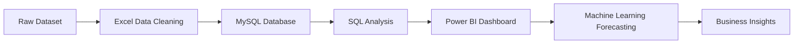

# 👟 Nike Sales Analysis (2020–2021)

<p align="center">
  
  
  
</p>

---

#  Project Overview

The **Nike Sales Analysis & Machine Learning Dashboard (2020–2021)** is a complete data analytics project focused on analyzing sales performance, customer behavior, regional trends, and forecasting future sales using Machine Learning techniques.

The project was developed using:

- 📊 Microsoft Excel
- 📈 Power BI
- 🛢️ MySQL
- 🐍 Python (Machine Learning)

The dashboard converts raw sales data into interactive visualizations and predictive insights for better business decision-making.

---

# Project Objectives

- Analyze regional and product sales performance  
- Identify top-selling products and categories  
- Understand customer purchasing behavior  
- Create interactive dashboards and KPI reports  
- Perform trend analysis and forecasting  
- Predict future sales using Machine Learning  

---

# Tools & Technologies

| Tool | Purpose |
|------|----------|
| Microsoft Excel | Data Cleaning & Preparation |
| MySQL | Database Management & SQL Analysis |
| Power BI | Dashboard & Data Visualization |
| Python | Machine Learning & Forecasting |

---

# Machine Learning Implementation

Implemented Machine Learning models using Python to:

- Predict future sales trends
- Analyze historical sales patterns
- Generate sales forecasting insights
- Improve business decision-making

### Libraries Used

```python
pandas
numpy
matplotlib
scikit-learn
```

### ML Techniques

- Linear Regression
- Trend Forecasting
- Predictive Analytics

---

# Dataset Information

The dataset contains:

- Order Date
- Region
- Product Category
- Sales Revenue
- Profit
- Units Sold
- Retailer Details
- Customer Information

---

# Dashboard Features

- Interactive KPI Cards  
- Regional Sales Analysis  
- Product Performance Dashboard  
- Profit & Revenue Tracking  
- Dynamic Filters & Slicers  
- Customer Insights  
- Sales Forecast Visualization  
- Trend Analysis Dashboard  

---

# Key Insights

- Identified highest revenue-generating regions  
- Tracked monthly and yearly sales growth  
- Analyzed customer buying behavior  
- Predicted future sales trends using ML  
- Improved business visibility with dashboards  

---

#  Data Cleaning & Preparation

- Removed duplicate records
- Handled missing values
- Standardized date formats
- Performed data transformation
- Ensured data consistency and accuracy

---

#  SQL Analysis

Example SQL Query:

```sql
SELECT region, SUM(sales) AS total_sales
FROM nike_sales
GROUP BY region
ORDER BY total_sales DESC;
```

---

#  Dashboard Preview

## Power BI Dashboard

<p align="center">
  
</p>

> Replace `dashboard-preview.png` with your actual dashboard screenshot.

---

#  Project Workflow



---

#  Skills Demonstrated

- Data Cleaning
- SQL Querying
- Data Visualization
- Dashboard Development
- Machine Learning
- Sales Forecasting
- Trend Analysis
- Business Intelligence
- Predictive Analytics

---

# Project Structure

```bash
Nike-Sales-Analysis-ML/
│
├── Dataset/
├── SQL Queries/
├── PowerBI Dashboard/
├── Machine Learning/
├── Excel Files/
├── dashboard-preview.png
└── README.md
```

---

# Future Improvements

- Add advanced forecasting models
- Deploy dashboard online
- Integrate real-time data
- Build AI-powered recommendation system

---

#  Author

## Muhammed Nishad PM

📧 Email: your-email@example.com  
🌐 GitHub: https://github.com/yourusername  
💼 Aspiring Data Analyst | Power BI Developer | ML Enthusiast

---

u found this project useful, give it a ⭐ on GitHub!

---
